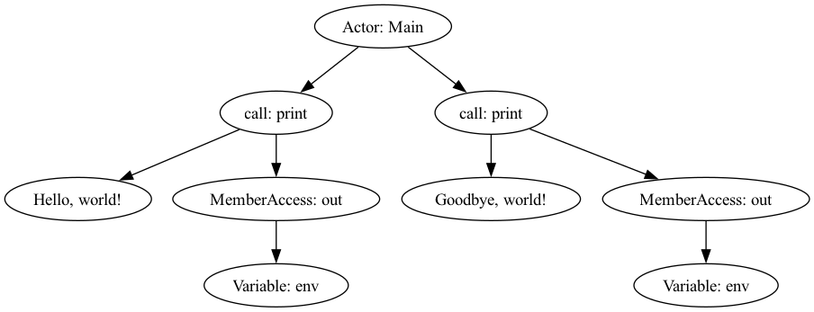

# Homework 3J: Little Pony Scanner & Parser

This is my draft solution. Note that this is NOT perfect! I don't expect yours
to be perfect either! Code is a process that requires revision and iteration.
This is just one possible solution. Your solution may be better in some ways and
worse in others. That's okay! 

## Scanner 

After the class discussion I reviewed the Pony keywords documentation and
removed the `create` keyword. Y'all were right, it's not a keyword in Pony.

### Simplified Actor Model

Given time constraints, I decided to hardcode the constructor pattern within
actor declarations. This simplification means our version of Little Pony does
not support multiple methods or constructors per actor.

This is why the constructor method is missing from the parse tree. That's not
correct, it's just a simplification for this assignment.

### Expression Parsing
I focused on parsing identifiers and string literals initially, then expanded to
handle method calls and member access expressions.  This approach allowed me to
build up complexity gradually.

### Method Calls & Member Access

Implemented these features with an eye towards supporting chained
calls/accesses. While not fully fleshed out due to time constraints, this lays
groundwork for more complex expression parsing in future
iterations.
